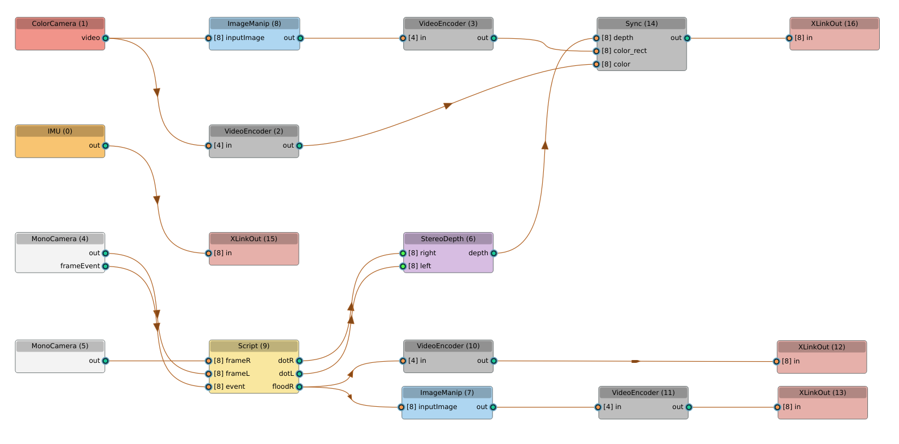

# Depthai IR Split Pipeline

This pipeline is based on the IR toggle script example and provides a mono image (from the global shutter cameras) *without* IR dots (thus usable for, e.g., visual odometry). The IR dots are still used for stereo depth.
Notice that this halves the framerate for both.

**Pipeline Outputs:**
* RGB (compressed)
* RGB rectified (compressed)
* stereo depth (raw), compressed by host
* right mono (compressed), *without* IR dots
* right mono rectified (compressed), *without* IR dots
* IMU raw